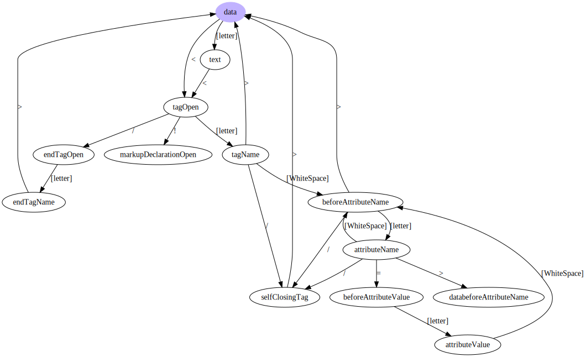
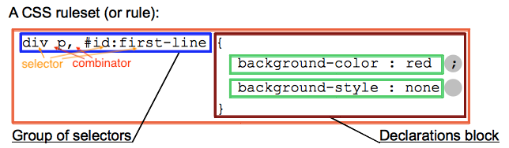
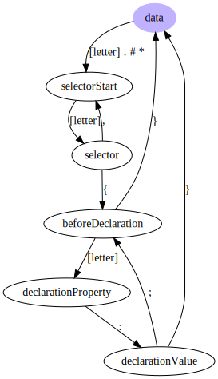

# tinyhtmlparser

最近在学习winter老师在极客时间的《重学前端》课程，里面有几讲解释了浏览器是如何工作的，因此就有了做个浏览器的想法（误，哈哈，实际上只是一个玩具而已），并打算把过程记录在这个项目中。

预计用两周时间，实现一个从请求页面到绘制到界面上的*浏览器*，不涉及`js`部分实现，也就是只会做一个支持渲染`html`+`css`的浏览器。预计会了解到`http`协议、编译原理、DOM树、CSSOM、浏览器渲染、排版方面的知识。

以下是预计进行的流程


1. HTMLParser: HTML到DOM树
2. CSSPareser: CSS规则解析
3. Attachment: CSS计算，把CSS规则应用到DOM树上（Render Tree）
4. Layout: Render Tree 排版
5. Paint/Composite: 最后一步：绘制、合成

## HTML到DOM树

学习了winter老师的《重学前端 | <11 | 浏览器：一个浏览器是如何工作的？（阶段二）>》做的一个简单的`html`编译器

### 编译过程

图来自[此处](https://developers.google.com/web/fundamentals/performance/critical-rendering-path/constructing-the-object-model?hl=zh-cn)


#### 词法状态机

参考winter老师的画的状态机，画了本项目实行的状态机图，其中描述标签部分还待完善。



### Example

```html
<html>
<head>
  <title>Page Title</title>
</head>
<body>
  <p>hello world</p>
  <input class="input" foucus/>
  <button onclick='alert("asd");'>asd</button>
</body>
</html>
```

Html to DOM tree

```json
{
  "nodeType": 9,
  "childNodes": [
    {
      "nodeType": 1,
      "tagName": "html",
      "childNodes": [
        {
          "nodeType": 3,
          "data": "\n"
        },
        {
          "nodeType": 1,
          "tagName": "head",
          "childNodes": [
            {
              "nodeType": 3,
              "data": "\n  "
            },
            {
              "nodeType": 1,
              "tagName": "title",
              "childNodes": [
                {
                  "nodeType": 3,
                  "data": "Page Title"
                }
              ]
            },
            {
              "nodeType": 3,
              "data": "\n"
            }
          ]
        },
        {
          "nodeType": 3,
          "data": "\n"
        },
        {
          "nodeType": 1,
          "tagName": "body",
          "childNodes": [
            {
              "nodeType": 3,
              "data": "\n  "
            },
            {
              "nodeType": 1,
              "tagName": "p",
              "childNodes": [
                {
                  "nodeType": 3,
                  "data": "hello world"
                }
              ]
            },
            {
              "nodeType": 3,
              "data": "\n  "
            },
            {
              "nodeType": 1,
              "tagName": "input",
              "childNodes": [],
              "class": "input",
              "foucus": ""
            },
            {
              "nodeType": 3,
              "data": "\n  "
            },
            {
              "nodeType": 1,
              "tagName": "button",
              "childNodes": [
                {
                  "nodeType": 3,
                  "data": "asd"
                }
              ],
              "onclick": "alert(\"asd\");"
            },
            {
              "nodeType": 3,
              "data": "\n"
            }
          ]
        },
        {
          "nodeType": 3,
          "data": "\n"
        }
      ]
    }
  ]
}
```

## Parse CSS

解析`css`字符串，产生`CSSStyleSheet`对象

[MDN: CSS语法](https://developer.mozilla.org/zh-CN/docs/Learn/CSS/Introduction_to_CSS/Syntax)



### 词法状态机


